# 03 — Banco de Dados (Modelo Entidade-Relacionamento)

> PostgreSQL multi-tenant. **Toda** tabela tem `company_id` (FK → `company`) e RLS por `company_id`. A camada financeira é **unificada**; a operação de **Serviços** (NFSe/contratos) e a de **Holdings** (imóveis/aluguéis) ficam separadas e ambas desaguam na mesma estrutura financeira.

Enums principais: `company_type = (SERVICE | HOLDING)`, `tax_regime = (SIMPLES_NACIONAL | LUCRO_PRESUMIDO | LUCRO_REAL)`, `entry_type = (PAYABLE | RECEIVABLE)`.

> **Convenções de linguagem no modelo:** períodos usam `reference_month` (o **mês**, nunca "competência"); valores monetários usam `amount`/`value` (nunca "investment").

## Diagrama ER

```mermaid
erDiagram
    COMPANY ||--o{ MEMBERSHIP : tem
    USER    ||--o{ MEMBERSHIP : participa
    COMPANY ||--|| SUBSCRIPTION : assina
    PLAN    ||--o{ SUBSCRIPTION : oferece
    COMPANY ||--o{ INTEGRATION_CREDENTIAL : configura
    COMPANY ||--o{ VAULT_DOCUMENT : guarda
    COMPANY ||--o{ TICKET : abre
    COMPANY ||--o{ NOTIFICATION : recebe
    COMPANY ||--o{ TAX_GUIDE : possui
    COMPANY ||--o{ ACCOUNTING_INVOICE : recebe
    COMPANY ||--o{ EMPLOYEE : emprega

    %% ----- FINANCEIRO UNIFICADO (comum a SERVICE e HOLDING) -----
    COMPANY      ||--o{ BANK_ACCOUNT : detem
    COMPANY      ||--o{ CATEGORY : classifica
    COMPANY      ||--o{ FINANCIAL_ENTRY : movimenta
    BANK_ACCOUNT ||--o{ FINANCIAL_ENTRY : registra
    BANK_ACCOUNT ||--o{ BANK_TRANSACTION : importa
    CATEGORY     ||--o{ FINANCIAL_ENTRY : rotula
    FINANCIAL_ENTRY  ||--o| RECONCILIATION_MATCH : concilia
    BANK_TRANSACTION ||--o| RECONCILIATION_MATCH : concilia

    %% ----- OPERAÇÃO SERVICE: Meu Negócio -----
    COMPANY  ||--o{ CUSTOMER : atende
    CUSTOMER ||--o{ CONTRACT : assina
    CONTRACT ||--o{ SERVICE_INVOICE : gera
    CUSTOMER ||--o{ SERVICE_INVOICE : recebe
    CONTRACT ||--o{ SIGNATURE_REQUEST : envia
    SERVICE_INVOICE ||--o| FINANCIAL_ENTRY : "vira recebível"

    %% ----- DEPARTAMENTO PESSOAL -----
    EMPLOYEE ||--o{ PAYSLIP : tem
    EMPLOYEE ||--o{ VACATION_PERIOD : tira
    EMPLOYEE ||--o{ EMPLOYMENT_EVENT : registra

    %% ----- OPERAÇÃO HOLDING: Gestão Patrimonial -----
    COMPANY  ||--o{ PROPERTY : possui
    COMPANY  ||--o{ PARTNER : tem
    PROPERTY ||--o{ LEASE : aluga
    LEASE    ||--o{ RENT_INVOICE : fatura
    LEASE    ||--o{ SIGNATURE_REQUEST : envia
    RENT_INVOICE ||--o| FINANCIAL_ENTRY : "vira recebível"
    PARTNER  ||--o{ PARTNER_DISTRIBUTION : recebe

    %% ----- SUPORTE -----
    TICKET ||--o{ TICKET_MESSAGE : contem

    COMPANY {
        uuid id PK
        string legal_name
        string trade_name
        string cnpj
        enum   company_type "SERVICE | HOLDING"
        enum   tax_regime
        numeric revenue_ceiling "teto p/ Termômetro Tributário"
        timestamptz created_at
    }
    USER {
        uuid id PK
        string name
        string email
        string auth_uid "Supabase auth"
    }
    MEMBERSHIP {
        uuid id PK
        uuid company_id FK
        uuid user_id FK
        enum role "OWNER|ADMIN|FINANCE|STAFF|ACCOUNTANT|VIEWER"
    }
    BANK_ACCOUNT {
        uuid id PK
        uuid company_id FK
        string bank_name
        string number
        numeric current_balance
        string open_finance_item_id "vínculo Open Finance"
    }
    CATEGORY {
        uuid id PK
        uuid company_id FK
        string name
        enum kind "INCOME | EXPENSE"
    }
    FINANCIAL_ENTRY {
        uuid id PK
        uuid company_id FK
        uuid bank_account_id FK
        uuid category_id FK
        enum type "PAYABLE | RECEIVABLE"
        enum status "PENDING|PAID|OVERDUE|CANCELED"
        numeric amount
        date due_date
        date reference_month "o MÊS"
        string source "NFSE|RENT|MANUAL|IMPORT"
        uuid source_id "id da origem (nfse/aluguel)"
    }
    BANK_TRANSACTION {
        uuid id PK
        uuid company_id FK
        uuid bank_account_id FK
        date posted_at
        numeric amount
        string description
        enum reconciliation_status "UNMATCHED|MATCHED|IGNORED"
    }
    RECONCILIATION_MATCH {
        uuid id PK
        uuid company_id FK
        uuid bank_transaction_id FK
        uuid financial_entry_id FK
        timestamptz matched_at
    }
    CUSTOMER {
        uuid id PK
        uuid company_id FK
        string name
        string document "CPF/CNPJ"
        string email
    }
    CONTRACT {
        uuid id PK
        uuid company_id FK
        uuid customer_id FK
        string title
        numeric value "valor do contrato (NUNCA investimento)"
        enum billing_cycle "MONTHLY|QUARTERLY|SEMIANNUAL|ANNUAL"
        enum status "DRAFT|ACTIVE|SUSPENDED|CANCELED|FINISHED"
        date next_billing_date
    }
    SERVICE_INVOICE {
        uuid id PK
        uuid company_id FK
        uuid customer_id FK
        uuid contract_id FK
        string nfse_number
        numeric amount
        date reference_month "o MÊS"
        enum status "DRAFT|ISSUING|ISSUED|CANCELED|ERROR"
        string provider_protocol
    }
    SIGNATURE_REQUEST {
        uuid id PK
        uuid company_id FK
        string subject_type "CONTRACT | LEASE"
        uuid subject_id
        enum status "PENDING|SENT|SIGNED|REFUSED|EXPIRED"
        string provider_envelope_id
    }
    TAX_GUIDE {
        uuid id PK
        uuid company_id FK
        string tax_name "DAS, INSS, ..."
        date reference_month "o MÊS"
        numeric amount
        date due_date
        string pix_code "botão Copiar Pix"
        enum status "OPEN|PAID|OVERDUE"
    }
    ACCOUNTING_INVOICE {
        uuid id PK
        uuid company_id FK
        string description "honorários contábeis"
        numeric value "valor (NUNCA investimento)"
        date reference_month "o MÊS"
        date due_date
        enum status "OPEN|PAID|OVERDUE"
        string pix_code
    }
    EMPLOYEE {
        uuid id PK
        uuid company_id FK
        string name
        string cpf
        string role_title
        numeric salary
        enum status "ACTIVE|ON_VACATION|TERMINATED"
        date admission_date
    }
    PAYSLIP {
        uuid id PK
        uuid employee_id FK
        date reference_month "o MÊS"
        numeric net_amount
        string file_url
    }
    VACATION_PERIOD {
        uuid id PK
        uuid employee_id FK
        date start_date
        date end_date
    }
    EMPLOYMENT_EVENT {
        uuid id PK
        uuid employee_id FK
        enum type "ADMISSION | TERMINATION"
        date event_date
        jsonb form_data
    }
    PROPERTY {
        uuid id PK
        uuid company_id FK
        string label
        enum   kind "APARTMENT|HOUSE|COMMERCIAL|LAND|OTHER"
        enum   status "AVAILABLE|RENTED|MAINTENANCE|SOLD"
        string address
        numeric acquisition_value
    }
    LEASE {
        uuid id PK
        uuid company_id FK
        uuid property_id FK
        string lessee_name "locatário"
        numeric monthly_rent
        enum index_type "IPCA | IGPM"
        date adjustment_anchor "mês-base do reajuste"
        enum status "ACTIVE|ENDED|CANCELED"
    }
    RENT_INVOICE {
        uuid id PK
        uuid company_id FK
        uuid lease_id FK
        date reference_month "o MÊS"
        numeric amount
        enum status "OPEN|PAID|OVERDUE|CANCELED"
        string boleto_url
        string receipt_url
    }
    PARTNER {
        uuid id PK
        uuid company_id FK
        string name
        numeric ownership_pct "participação societária"
    }
    PARTNER_DISTRIBUTION {
        uuid id PK
        uuid partner_id FK
        date reference_month "o MÊS"
        numeric gross_profit
        numeric taxes "Lucro Presumido"
        numeric net_distributed "lucro após impostos"
    }
    VAULT_DOCUMENT {
        uuid id PK
        uuid company_id FK
        string title "Contrato Social, Alvará..."
        string file_url
        boolean pinned "arquivo fixo"
    }
    TICKET {
        uuid id PK
        uuid company_id FK
        string subject
        enum status "OPEN|IN_PROGRESS|WAITING_CLIENT|RESOLVED|CLOSED"
        enum priority "LOW|MEDIUM|HIGH|URGENT"
    }
    TICKET_MESSAGE {
        uuid id PK
        uuid ticket_id FK
        uuid author_user_id FK
        text body
    }
    PLAN {
        uuid id PK
        string name "Início | Crescimento"
        numeric monthly_value "valor mensal (NUNCA investimento)"
        jsonb features
    }
    SUBSCRIPTION {
        uuid id PK
        uuid company_id FK
        uuid plan_id FK
        enum status "ACTIVE|PAST_DUE|CANCELED|TRIAL"
        date current_period_start
        date current_period_end
    }
    INTEGRATION_CREDENTIAL {
        uuid id PK
        uuid company_id FK
        enum kind "NFSE|ELECTRONIC_SIGNATURE|OPEN_FINANCE"
        string provider
        jsonb secret_ref "ref a secret manager"
        boolean active
    }
    NOTIFICATION {
        uuid id PK
        uuid company_id FK
        enum severity "INFO|WARNING|URGENT"
        string title
        text body
        boolean read
    }
```

## Notas de modelagem

- **Camada financeira unificada** — `FINANCIAL_ENTRY` é o coração. Uma `SERVICE_INVOICE` (NFSe) e uma `RENT_INVOICE` (aluguel) ambas criam um lançamento `RECEIVABLE`, ligado pela dupla `source` + `source_id`. Assim o **Dashboard** (Faturamento do Mês, Despesas, Fluxo de Caixa) e a **Conciliação** funcionam idênticos para SERVICE e HOLDING.
- **Separação operacional** — tabelas de `CUSTOMER/CONTRACT/SERVICE_INVOICE` só são populadas para `company_type = SERVICE`; `PROPERTY/LEASE/RENT_INVOICE/PARTNER` só para `HOLDING`. As policies de UI e os services usam `CompanyType` como guarda.
- **Termômetro Tributário** — `company.revenue_ceiling` + soma de `service_invoice.amount` por `reference_month` alimentam o cálculo de limite e Fator R; alertas viram linhas em `NOTIFICATION`.
- **Reajuste de aluguel** — `lease.index_type` (IPCA/IGPM) + `adjustment_anchor` permitem o job de reajuste automático ao completar 12 meses.
- **Rentabilidade do sócio** — `PARTNER_DISTRIBUTION` guarda lucro bruto, impostos (Lucro Presumido) e líquido distribuído por **mês**.
- **Copiar Pix** — `tax_guide.pix_code` e `accounting_invoice.pix_code` guardam o copia-e-cola.
- **RLS** — todas as tabelas filtram por `company_id = current_setting('app.company_id')`. Ver `packages/db/migrations/0000_init.sql`.
